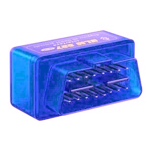

---
# Date this page was created.
date: 2020-06-02T00:00:00

# Project title.
title: "OBD logger"

# Project summary to display on homepage.
summary: "An OBD logger for a car, allowing for recording key values over time"

# Tags: can be used for filtering projects.
# Example: `tags: ["machine-learning", "deep-learning"]`
tags:
- Embedded programming
- unix
- python
- Soldering
- Raspberry Pi
- Electronic design

# Optional external URL for project (replaces project detail page).
#external_link: "https://github.com/hill-a/stable-baselines"

# Featured image
# To use, add an image named `featured.jpg/png` to your project's folder.
image:
  caption:
  # Focal point (optional)
  # Options: Smart, Center, TopLeft, Top, TopRight, Left, Right, BottomLeft, Bottom, BottomRight
  focal_point: Smart

---

# OBD logger



This project is still a work in progress.

The goal is to monitor the car's internal values, such as temperature, pressure, O2 meter, etc...
To then be able to determine potential faults over time, and observer patterns in the data for extrapolation of engine characteristics.

Furthermore, this unlocks the fault codes and the possibility of GPS logging, for analysis over time.

At the time of writing, a raspberry pi can connect to the OBD port, and log the desired values. The remote logging to a database is missing.

Here is the code I wrote for connecting the the OBD connector in python. Use as you want, in MIT licence.
```python
import serial
from serial.tools import list_ports
import json
import numpy as np


class obd_serial:
    """
    A serial interface for the OBD 2 protocol (https://en.wikipedia.org/wiki/OBD-II_PIDs)
    This class will connect to the device when created.

    :param device: (str) the OBD device (None for auto detect)
    :param baud: (int) the baud rate for the serial connection (default=38400)
    :param encoding: (str) the encoding type of the serial interface (default="ascii")
    """
    def __init__(self, device=None, baud=38400, encoding="ascii"):
        # use autodetect
        if device is None:
            print("auto-detecting device...")

            devices = list_ports.comports()
            if devices == []:
                raise ValueError("Cannot find any available com device at a baud rate of {}.".format(baud))

            found = False
            for dev in devices:
                valid, self.ser = self._check_serial(dev.device, baud)
                if valid:
                    found = True
                    print("found ELM327 on {}\r\n".format(dev.device))
                    break
            if not found:
                raise ValueError("Cannot find valid ELM device at a baud rate of {}.".format(baud))
        else:
            valid, self.ser = self._check_serial(device, baud)
            if not valid:
                raise ValueError("Device {} is not a valid ELM device at a baud rate of {}.".format(device, baud))

        self.encoding = encoding
        self._obd_lookup = json.load(open("./obd_parsing.json", "r"))

    @classmethod
    def _check_serial(cls, dev, baud):
        """
        checks the serial connection for an ELM327 chip

        :param dev: (str) the device to check
        :param baud: (int) the baud rate to check
        :return: (bool, serial.Serial) return whether the serial port is valid, and if so the said connection
        """
        try:
            ser = serial.Serial(dev, baud, timeout=0.5)
            try:
                ser.write(b"atz\r\n")
                ser.readline() # skip replay
                if ser.readline().startswith(b"ELM327"):
                    ser.readline()
                    ser.readline()
                    ser.timeout = None
                    return (True, ser)
                else:
                    return (False, None)
            except serial.SerialException as e:
                print(e)
                ser.close()
                return (False, None)
        except serial.SerialException as e:
            print(e)
            return (False, None)

    def _decoded_message(self, message, anwser):
        """
        Transformes an OBD query, into clear elements

        :param message: (str) the obd request
        :param anwser: ([int]) the obd anwser in int format
        :return: ({str: any}) the decoded obd anwser
        """
        info = self._obd_lookup[message.upper()]
        output = {"type": info["type"], "desc": info["desc"]}
        if info["type"] in ["support", "action"]: # ignore
            pass
        elif info["type"] == "raw": # just print out
            output["value"] = anwser
        elif info["type"] == "choice": # choose one from many
            found = False
            for i in range(0, len(info["values"]), 2):
                if info["values"][i] == str(anwser[0]):
                    output["value"] = info["values"][i+1]
                    found = True
                    break
            if not found:
                output["value"] = "INVALID VALUE '{}'".format(anwser[0])
        elif info["type"] == "eq": # calculate from equation
            output["value"] = []
            output["unit"] = []
            for i in range(0, len(info["values"]), 2):
                output["value"] += eval(info["values"][i].format(*anwser))
                output["unit"] += info["values"][i+1]
        elif info["type"] == "bit": # bit flag
            output["value"] = []
            for i in range(0, len(info["values"]), 2):
                # get the byte number A:0, B:1, C:2, ...
                byte = anwser[ord(info["values"][i][0].upper())-65]
                # get the associated bit, convert to boolean
                cond = bool((byte//2**int(info["values"][i][1]))%2)
                output["value"] += info["values"][i+1] + ": {}".format(cond)
        else:
            raise ValueError("Type {} not implemented".format(info["type"]))

        return output

    def _parse_message(self, message, anwser):
        """
        Transformes an OBD query, into a human readable format.

        :param message: (str) the obd request
        :param anwser: ([int]) the obd anwser in int format
        :return: (str) the parsed, human readable anwser
        """
        info = self._decoded_message(message, anwser)
        output = info["desc"]
        if info["type"] in ["support", "action"]: # ignore
            output += " (" + info["type"] + ")"
        elif info["type"] == "raw": # just print out
            output += "\r\n\t" + str(info["value"])
        elif info["type"] == "choice": # choose one from many
            output += "\r\n\t" + info["value"]
        elif info["type"] == "eq":  # calculate from equation
            for i in range(len(info["value"])):
                output += "\r\n\t" + str(info["value"][i]) + " " + info["unit"][i]
        elif info["type"] == "bit": # bit flag
            for i in range(len(info["value"])):
                output += "\r\n\t" + info["value"][i]
        else:
            raise ValueError("Type {} not implemented".format(info["type"]))

        return output

    def close(self):
        """
        Closes the OBD connection
        """
        self.ser.close()

    def _query(self, message):
        """
        Queries a message and parses the output to raw hex

        :param message: (str) the query message (hexadecimal) (https://en.wikipedia.org/wiki/OBD-II_PIDs)
        :return: ([str]) return the full raw hex anwser
        """
        try:
            int(message, 16)
        except ValueError:
            raise ValueError("requested messsage '{}' invalid, must be hexadecimal format.".format(message))

        enc_mess = bytes(message + "\r\n", self.encoding)
        self.ser.write(enc_mess)
        output = ""

        char = self.ser.read().decode(self.encoding)
        output += char
        count = 0
        while count < 4:
            if char == "\r" and count % 2 == 0:
                count += 1
            elif char == "\n" and count % 2 == 1:
                count += 1
            else:
                count = 0

            char = self.ser.read().decode(self.encoding)
            output += char

        return "\r\n".join(output.split("\r\n")[1:-2])

    def query_obd(self, message, output="human"):
        """
        Queries the OBD with a given message, and sanitizes it.
        Can raise a ValueError if the query is not supported, or not available.
        You can choose the output type between string, int, hex and human readable.

        :param message: (str) the query message (https://en.wikipedia.org/wiki/OBD-II_PIDs)
        :param output: (str) the output format (can be "str", "int", "hex", "decoded" or "human") (default="human")
        :return: ([int] or [str]) return the sanitizes anwser to the requested format
        """
        anwser = self._query(message)
        try:
            if int(anwser.split(" ")[0], 16) != int(message[:2], 16) + int('40', 16): # must anwser correctly
                raise ValueError("")
        except ValueError:
            raise ValueError("invalid anwser '{}' for query '{}'".format(anwser, message))

        if output == "int":
            return [int(a, 16) for a in anwser.split(" ")[2:-1]]
        elif output == "hex":
            return anwser.split(" ")[2:-1]
        elif output == "decoded" and messsage.upper() in self._obd_lookup: # if not in lookup, return string output
            return self._decoded_message(message, [int(a, 16) for a in anwser.split(" ")[2:-1]])
        elif output == "human" and message.upper() in self._obd_lookup: # if not in lookup, return string output
            return self._parse_message(message, [int(a, 16) for a in anwser.split(" ")[2:-1]])
        else:
            return anwser

    def supported_pid(self, service="01"):
        """
        Returns the supported pids for the requested service

        :param service: (str) the requested service in hex (can be '01', '02', '05', and '09') (default="01")
        :returns: ([str]) the supported hex pids for query
        """
        if service not in ['01', '02', '05', '09']:
            raise ValueError("Service '{}' does not support pid detection".format(service))
        supported = ['00']
        start = 1
        while int(supported[-1], 16) % 32 == 0:
            anwser = self.query_obd(service + supported[-1], "int")

            pids = []
            for byte in anwser:
                pids += [bool(int(a)) for a in bin(byte)[2:].zfill(8)]

            supported += [hex(a)[2:].zfill(2) for a in np.arange(start, 32 + start)[pids]]
            start += 32
        return supported

    def query_all(self):
        """
        Queries all the available pids for the 01 service,
        and parses the to human readable format.

        :returns: (str) the parsed queries
        """
        output = ""
        for pid in self.supported_pid("01"):
            if self._obd_lookup[("01"+pid).upper()]["type"] not in ["action", "support"]:
                try:
                    output += self.query_obd("01"+pid, "human")
                except ValueError:
                    output += self._obd_lookup[("01"+pid).upper()]["desc"] + "\r\n\tNO DATA"

                output += "\r\n-------------------------------\r\n"
        return output

```