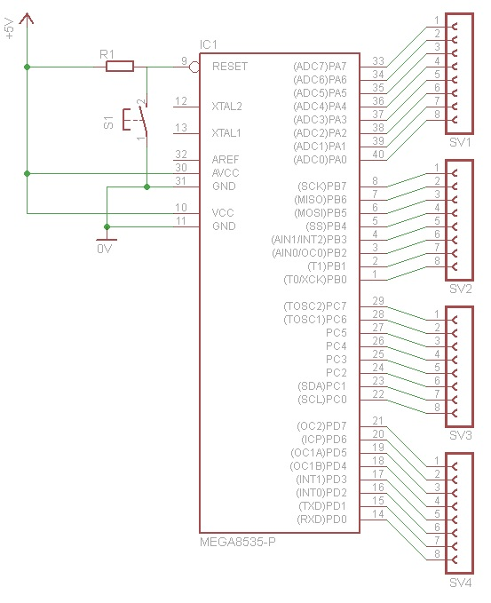
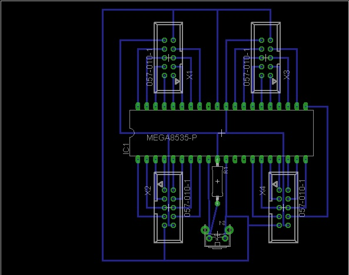
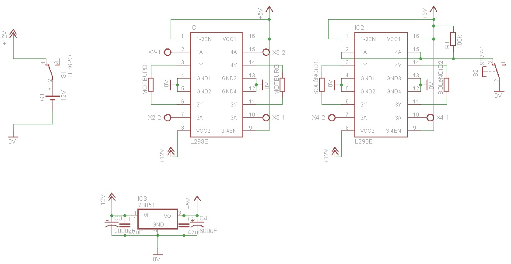
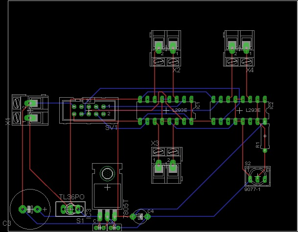

---
# Date this page was created.
date: 2012-06-02T00:00:00

# Project title.
title: "S.E.A.T.A "

# Project summary to display on homepage.
summary: "My first robotic project, High school."

# Tags: can be used for filtering projects.
# Example: `tags: ["machine-learning", "deep-learning"]`
tags:
- microcontroller
- Embedded programming
- Robotics
- C-Cpp
- Soldering
- Electronic design

# Optional external URL for project (replaces project detail page).
#external_link: "https://github.com/hill-a/stable-baselines"

# Featured image
# To use, add an image named `featured.jpg/png` to your project's folder.
image:
  caption:
  # Focal point (optional)
  # Options: Smart, Center, TopLeft, Top, TopRight, Left, Right, BottomLeft, Bottom, BottomRight
  focal_point: Smart

---

# S.E.A.T.A.

 

S.E.A.T.A. is a robotics project where I participated in high school. The goal of the project was to design a robot from the ground up, that could follow a black line, avoid obstacles, and send a ball into a goal. This robot was then used in a county robotics contest between high schools, where S.E.A.T.A. won first place in speed.

My participation in the project consisted of designing the control board based on a ATMega8535, a power board, and a motor control board.

## The control board

  

A modular style of "plugs" that both supplied low current power and gave 8 pins of a port for communicating with the MCU was devised.
It allowed for quick prototyping and debugging, while keeping the footprint of the board relatively small.

  

As the ATMega8535 only used 15mA of current, this setup was deemed sufficient for the robot.

## The power & motor control board

  

The most power hungry devise of the robot, was the two lateral motors. As such, the power regulation and motor control board were unified to limit potential power issues.
However, this also caused some issues that needed to be solved due to the motors and the MCU sharing the same power rail.

  

## Under the hood

  

## Demo

<video controls width="250">
    <source src="2012-05-11 10.38.06.m4v" type="video/mp4">

    Download the
    <a href="2012-05-11 10.38.06.m4v">MP4</a>
    video.
</video>