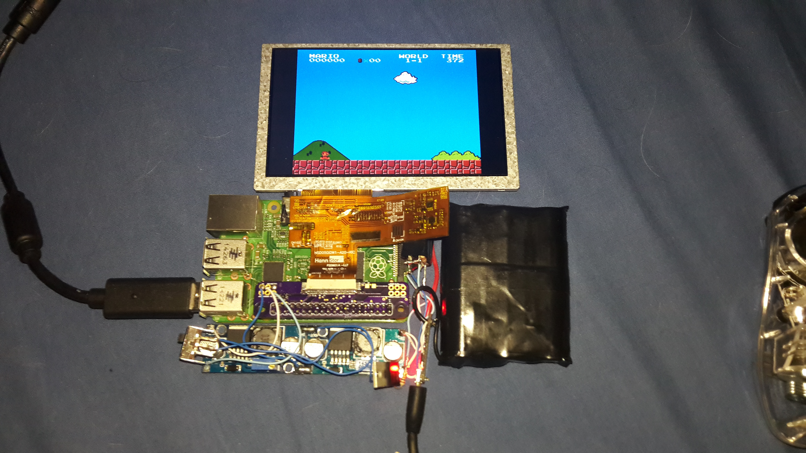

---
# Date this page was created.
date: 2016-07-02T00:00:00

# Project title.
title: "Portable Pi"

# Project summary to display on homepage.
summary: "A portable power efficient Raspberry pi"

# Tags: can be used for filtering projects.
# Example: `tags: ["machine-learning", "deep-learning"]`
tags:
- Soldering
- Raspberry Pi
- Electronic design
- Unix

# Optional external URL for project (replaces project detail page).
#external_link: "https://github.com/hill-a/stable-baselines"

# Featured image
# To use, add an image named `featured.jpg/png` to your project's folder.
image:
  caption:
  # Focal point (optional)
  # Options: Smart, Center, TopLeft, Top, TopRight, Left, Right, BottomLeft, Bottom, BottomRight
  focal_point: Smart

---

# Portable Pi

This project was born from a desire to create a portable raspberry pi, for retro gaming, and as a remote shell to connect to my home server.

It is based on the [Adafruit DPI TFT](https://www.adafruit.com/product/2454) for the GPIO to DPI connector, which was redesigned and built by hand.
The power system is based on three reused laptop 18650 cells in parallel, with two boost converters in series: the first 2.8v-4.2v to 5v for powering the raspberry pi, the second 5v to 22v for the backlight of the TFT screen.

It was designed like this to minimize the power usage of the system as whole, and allowed for around 8h of high load, and a theoretical 16h of idle usage.

The extra parts visible are the USB lipo charger, and some mosfets to switch to USB power instead of the Lipo when charging.

Overall, this project was not used daily, due to the large bulk. But I would like to redesign it one day with the Raspberry pi compute modules, which would allow for a slimer and lighter build.